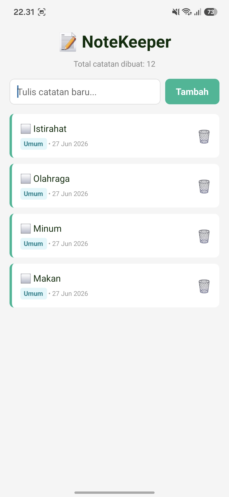
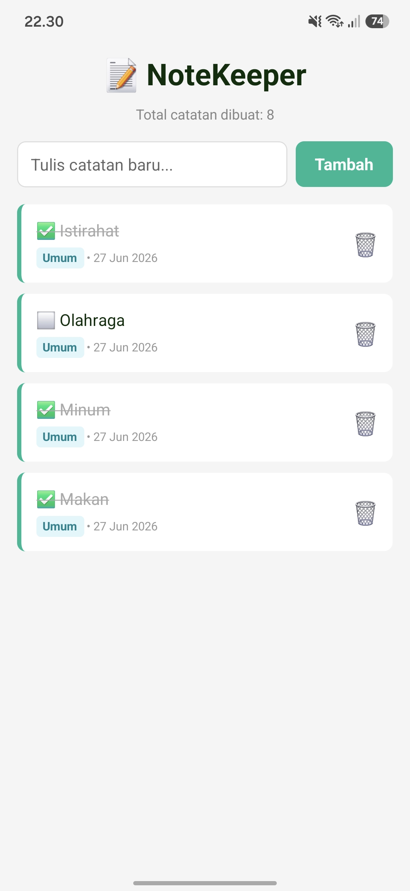
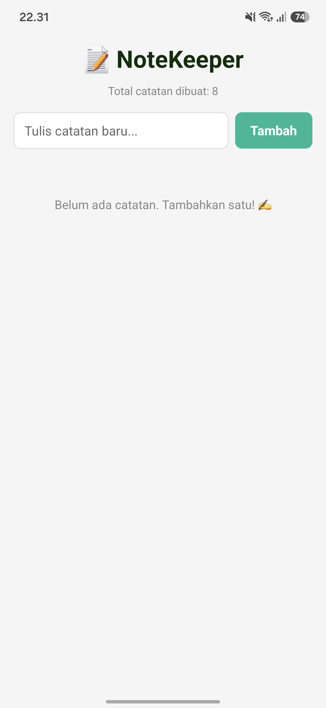

📝 NoteKeeper
Deskripsi Aplikasi

NoteKeeper merupakan aplikasi pencatat sederhana berbasis React Native (Expo) yang menggunakan AsyncStorage sebagai penyimpanan lokal. Data catatan akan tetap tersimpan meskipun aplikasi ditutup atau perangkat dimatikan.

Aplikasi ini menerapkan konsep CRUD (Create, Read, Update, Delete) serta penyimpanan data persisten menggunakan AsyncStorage.

Fitur Aplikasi
✅ Level 1 (Core)
Create (Menambah catatan baru)
Read (Memuat data dari AsyncStorage saat aplikasi dibuka)
Update (Menandai catatan selesai)
Delete (Menghapus catatan)
FlatList untuk menampilkan daftar catatan
Empty State ketika belum ada catatan
Persistensi data menggunakan AsyncStorage

✅ Level 2 (Fitur Tambahan)

✔ Toggle Status Selesai

Catatan dapat ditandai selesai dengan mengetuk item.
Status akan tersimpan walaupun aplikasi ditutup.

✔ Statistik

Menampilkan total catatan yang pernah dibuat.
Data statistik disimpan menggunakan AsyncStorage.

✔ Timestamp

Menampilkan tanggal pembuatan setiap catatan.

✔ Kategori

Setiap catatan memiliki kategori default "Umum".

Teknologi yang Digunakan
React Native
Expo
JavaScript
AsyncStorage
Expo Go

Cara Menjalankan
Install dependency
npm install
Install AsyncStorage
npx expo install @react-native-async-storage/async-storage
Jalankan project
npx expo start
Scan QR Code menggunakan aplikasi Expo Go pada Android atau iPhone.

Screenshot

Screenshot 1

Daftar Catatan

Screenshot 2

Fitur Toggle Status Selesai

Screenshot 3

Bukti delete
(Sebelum aplikasi ditutup)

Screenshot 4

Bukti Persistensi
(Setelah aplikasi dibuka kembali)

Expo Snack
https://snack.expo.dev/@fatur07-02/note-keeper
